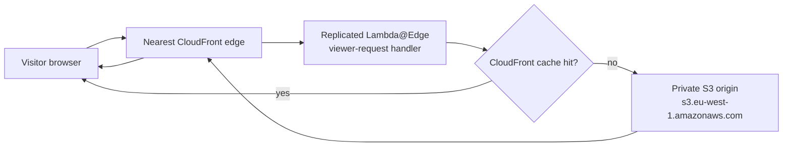
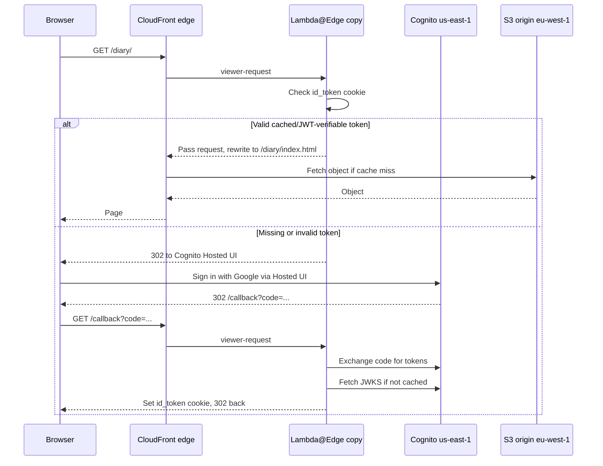
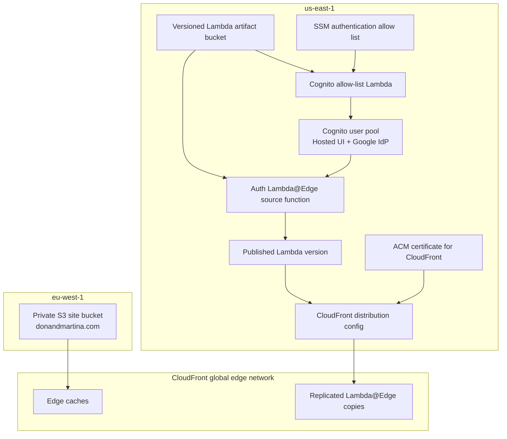

# us-east-1 coupling and request flow

This site does **not** serve every request from us-east-1. Runtime traffic is handled at the nearest CloudFront edge location. The origin bucket is in `eu-west-1`, and us-east-1 is mainly the control-plane and auth home region required by CloudFront, Lambda@Edge, ACM, and Cognito.

## Normal request path

The Lambda@Edge code is authored and versioned in us-east-1, but CloudFront replicates that published version to edge locations. A London visitor normally runs the edge copy near London, not the original us-east-1 Lambda runtime.

## Authenticated request path

The steady-state page request can stay local to CloudFront edge plus cache. us-east-1 is contacted during login, callback token exchange, and occasional JWKS refreshes from a warm edge Lambda process.

## Deployment and control-plane coupling

The site stack is deployed in us-east-1 because CloudFront requires its ACM certificate there, and Lambda@Edge requires the associated function version there. The static content deploy uses `eu-west-1` because that is where the origin bucket lives.

## Coupling surface summary

| Surface | Region | Request-time? | Why it exists |
|---|---:|---:|---|
| CloudFront edge cache and Lambda@Edge replica | nearest edge | yes | Handles viewer requests close to the visitor. |
| S3 origin bucket | eu-west-1 | cache misses only | Stores the generated Hugo site. |
| Auth Lambda@Edge source function and version | us-east-1 | no, except as source for replicas | Lambda@Edge functions must be created and versioned in us-east-1. |
| Cognito Hosted UI and user pool | us-east-1 | login/callback only | Provides Google-backed sign-in and token issuer. |
| Cognito JWKS endpoint | us-east-1 | occasional | Edge Lambda validates JWT signatures and caches JWKS in-process. |
| Cognito allow-list Lambda | us-east-1 | signup and every authentication | Cognito triggers gate allowed emails against Parameter Store. |
| ACM certificate | us-east-1 | TLS control plane | CloudFront viewer certificates must be in us-east-1. |
| Lambda artifact bucket | us-east-1 | deploy only | Lambda fetches zips from its own region; cross-region artifacts cause redirects. |
| CloudFormation stacks | us-east-1 | deploy only | Owns the CloudFront, ACM, Lambda@Edge, and Cognito resources. |

## Mental model

Think of us-east-1 as the **auth and edge-control home region**, not as the main content-serving region. Visitors are primarily served by CloudFront edge locations, with `eu-west-1` S3 as the origin behind the cache.
